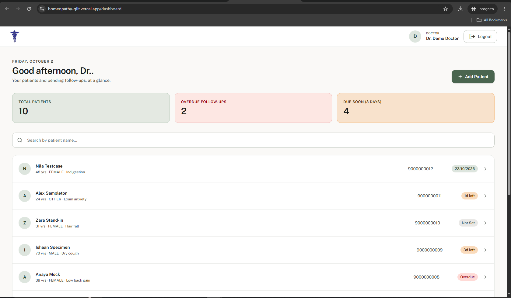
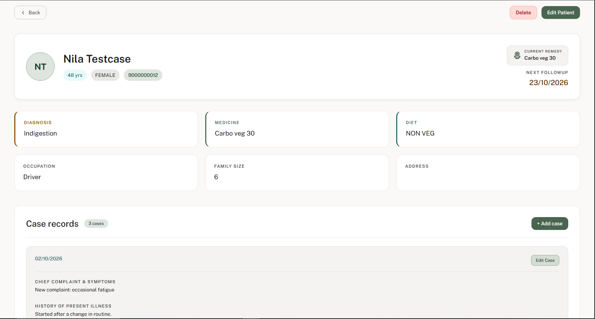
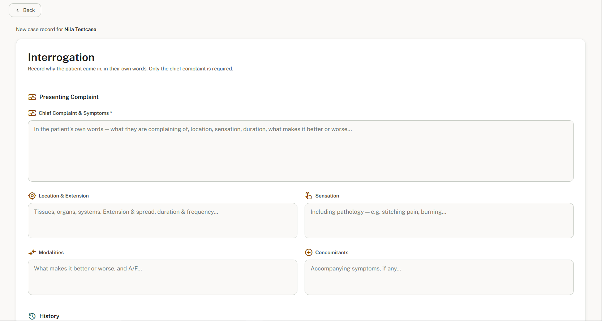
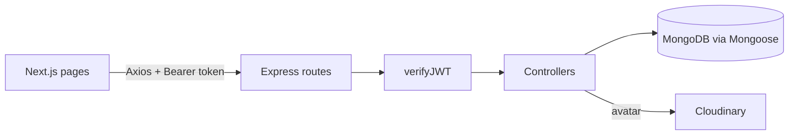

# Homeopathy Clinic Management System

A web app for homeopathy doctors to keep patient records, structured case-taking notes, and follow-up history in one place.

## Demo

- **Live app:** `<LIVE_URL>`
- **Demo login:** email `<DEMO_EMAIL>` / password `<DEMO_PASSWORD>`

| Dashboard | Patient detail | Case form |
|---|---|---|
|  |  |  |

Add the three images at `docs/screenshots/dashboard.png`, `docs/screenshots/patient-detail.png`, and `docs/screenshots/case-form.png`.

## Key features

- **Doctor accounts with JWT auth.** Register and log in; passwords are bcrypt-hashed in a Mongoose pre-save hook. Login issues an access token and a refresh token; every data route runs through a `verifyJWT` middleware that accepts a Bearer header or cookie.
- **Per-doctor data isolation.** Every patient belongs to one doctor. List, read, update, and delete queries all filter by the logged-in doctor's id, and a compound unique index on `(doctor, phoneNumber)` prevents duplicate patients per doctor.
- **Patient CRUD with server-side validation.** Required-field checks, a 10-digit phone number check, and ObjectId validation before any database call.
- **Structured case taking.** A case holds a chief complaint plus an optional "interrogation" section modelled on a paper intake form: presenting complaint, history, past history, and a personal-history block with a thermal-reactivity enum.
- **Two-step patient registration.** The add-patient flow creates the patient, then the first case. The created patient id is remembered so a failed case submission can be retried without creating a duplicate patient.
- **Follow-up history.** Add, edit, and delete dated follow-up entries (symptoms, medicine, advice) per patient, with paginated listing.
- **Paginated dashboard with search.** Server-side pagination plus a debounced search box that filters by patient name or phone number (case-insensitive, regex-escaped) while keeping page counts correct.
- **Avatar upload.** Multer writes the file to disk, then it is pushed to Cloudinary and the URL is saved on the doctor.
- **Hardened Express app.** Helmet, CORS allowlist, rate limiting (200 requests/minute), request sanitising against MongoDB operator injection, and gzip compression.

## Tech stack

- **Frontend:** Next.js 16 (App Router), React 19, TypeScript, Tailwind CSS 4, Axios, nextjs-toast-notify
- **Backend:** Node.js 20, Express 5, Mongoose 9, jsonwebtoken, bcrypt, Multer, Cloudinary SDK
- **Database:** MongoDB
- **Tooling:** npm, nodemon, ESLint (eslint-config-next), Node test runner with mongodb-memory-server, Docker, GitHub Actions

## Architecture

The Next.js frontend is a pure client of the API. Pages call a shared Axios instance that attaches the stored access token as a Bearer header and redirects to `/login` when the API reports an expired token. Express routes pass through `verifyJWT`, which loads the doctor from MongoDB and puts it on the request. Controllers validate input, run Mongoose queries scoped to that doctor, and return a uniform `ApiResponse` JSON envelope. Thrown `ApiError`s are turned into JSON error responses by the shared async wrapper.



```
backend/src
  app.js            Express app, middleware, route mounting
  index.js          Local entrypoint: connect to DB, listen
  routes/           doctor, patient, case, followUP
  controllers/      request handlers and validation
  models/           Doctor, Patient, Case, FollowUP schemas
  middleware/       auth (JWT), multer, error handler
  utility/          ApiError, ApiResponse, asyncHandler, cloudinary
backend/tests       API tests (node:test + mongodb-memory-server)
frontend/src
  app/              login, (protected)/dashboard, (protected)/patients/...
  components/       PatientForm, CaseForm, CaseDetails, Navbar, form inputs
  utils/            api.ts (Axios instance), case.ts (form <-> payload)
  types/            shared TypeScript interfaces
```

## Notable decisions

- **Token handling.** The access token is returned in the login JSON and kept in `localStorage`; Axios adds it as a Bearer header. The same tokens are also set as `httpOnly` cookies. The refresh token is stored on the doctor document and rotated by `POST /doctor/generateToken`, but the frontend does not call it yet: on `jwt expired` it clears storage and sends the user to login.
- **Errors and validation.** `ApiError` and `ApiResponse` give every response the same shape (`statusCode`, `success`, `message`, `data`). Validation is hand-written in each controller rather than a schema library; invalid ObjectIds and enum values return 400 before Mongoose sees them.
- **Case schema.** The interrogation is a set of nested sub-schemas with `_id: false`. Blank fields are pruned on both client and server so a case with only a chief complaint does not store a tree of empty strings. Updates replace the whole interrogation instead of merging, so cleared fields actually disappear.
- **Serverless-friendly DB connection.** `connectDB` caches the connection promise and is also invoked lazily on `/api/v1`, so `app.js` can be loaded directly by a serverless host without `index.js`.

## Getting started

Requires Node.js 20+ and a MongoDB instance.

```bash
# Backend
cd backend
npm install
cp .env.example .env   # then fill in the values described below
npm run dev            # nodemon on http://localhost:8000 (PORT from .env)

# Frontend (second terminal)
cd frontend
npm install
cp .env.example .env   # already points at http://localhost:8000/api/v1
npm run dev            # http://localhost:3000
```

| Variable | Where | Purpose |
|---|---|---|
| `MONGODB_URI` | backend | MongoDB connection string |
| `PORT` | backend | HTTP port (defaults to 3000 if unset) |
| `CORS_ORIGIN` | backend | Allowed browser origin (defaults to `http://localhost:3000`) |
| `ACCESS_TOKEN_SECRET` / `ACCESS_TOKEN_EXPIRE` | backend | Access JWT signing secret and lifetime, e.g. `1d` |
| `REFRESH_TOKEN_SECRET` / `REFRESH_TOKEN_EXPIRE` | backend | Refresh JWT signing secret and lifetime, e.g. `10d` |
| `CLOUDINARY_CLOUD_NAME` / `CLOUDINARY_API_KEY` / `CLOUDINARY_SECRET` | backend | Cloudinary account for avatar uploads |
| `NODE_ENV` | backend | `development` includes stack traces in error responses |
| `NEXT_PUBLIC_API_URL` | frontend | Base URL of the API, including `/api/v1` |

There is no seed script. Register a doctor through the login page to get started.

## API overview

All paths are prefixed with `/api/v1`. "Auth" means a valid access token is required.

| Method | Path | Auth | Purpose |
|---|---|---|---|
| POST | `/doctor/register` | no | Create doctor (multipart, optional `avatar`) |
| POST | `/doctor/login` | no | Login, returns access + refresh tokens |
| POST | `/doctor/logout` | yes | Clear refresh token and cookies |
| POST | `/doctor/generateToken` | no | Rotate tokens using the refresh token |
| PATCH | `/doctor/Details/:doctorId` | yes | Update name, email, degree |
| PATCH | `/doctor/Password/:doctorId` | yes | Change password |
| PATCH | `/doctor/Avatar/:doctorId` | yes | Replace avatar (multipart) |
| DELETE | `/doctor/doctor/:doctorId` | yes | Delete doctor account |
| POST | `/patient/register` | yes | Create patient |
| GET | `/patient/all-patient?page&limit&search` | yes | Paginated patients for this doctor, filtered by name or phone |
| GET | `/patient/search?patientName&diagnosis&medicine&phoneNumber` | yes | Case-insensitive search |
| GET / PATCH / DELETE | `/patient/:patientId` | yes | Read, update, delete one patient |
| POST | `/case/create-case/:patientId` | yes | Create a case for a patient |
| GET | `/case/patient-case/:patientId` | yes | List a patient's cases |
| PATCH | `/case/:caseId` | yes | Update a case |
| POST | `/followup/create-followup/:patientId` | yes | Add a follow-up |
| GET | `/followup/patient-followup/:patientId?page&limit` | yes | List follow-ups |
| PATCH / DELETE | `/followup/patient-followup/:followupId` | yes | Update or delete a follow-up |
| GET | `/api/health` (no `/v1`) | no | Liveness check with DB connection state |

## Testing and deployment

- **Tests:** `cd backend && npm test` runs six API tests with Node's built-in test runner against an in-memory MongoDB (no external database needed). They cover register and login, wrong password, missing token, patient validation and duplicate phone numbers, per-doctor isolation, and the search filter. The frontend has no tests; it has ESLint via `npm run lint`.
- **CI:** `.github/workflows/ci.yml` runs on pushes to `main` and on pull requests. Backend job: `npm ci`, module load check, `npm test`. Frontend job: `npm ci`, `npm run build`.
- **Docker:** `backend/Dockerfile` builds a `node:20-alpine` image that runs `node src/index.js` on port 8000. Pass the variables from the env table at run time. There is no Dockerfile for the frontend.
- **Hosting:** no `vercel.json` or platform config in the repo. The backend also works when `app.js` is loaded directly as a serverless function.

## Roadmap

1. Use `POST /doctor/generateToken` from the Axios interceptor to refresh silently instead of logging the doctor out on expiry.
2. Return 401 instead of 400 for missing or invalid tokens, and route all errors through the global error handler so stack traces and status codes are consistent.
3. Add frontend tests for the patient and case forms, and extend search to diagnosis and medicine.

## Author

**`<YOUR NAME>`** · GitHub [@jayy-codes07](https://github.com/jayy-codes07) · LinkedIn `<LINKEDIN_URL>` · `<EMAIL>`
