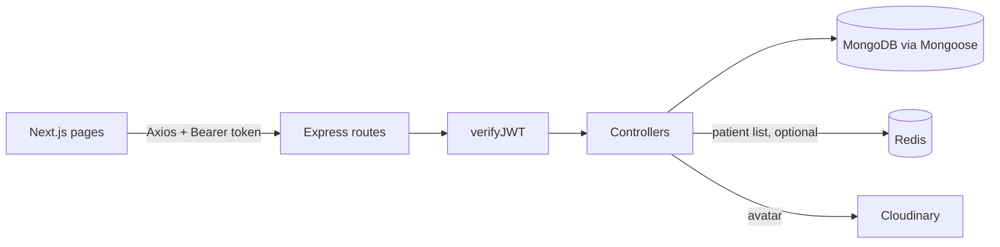

# Homeopathy Clinic Management System

A web app for homeopathy doctors to keep patient records, structured case-taking notes, and follow-up history in one place.

## Demo

- **Live app:** https://homeopathy-gilt.vercel.app/
- **Demo login:** email `demo@example.com` / password `homeo-demo-2026`
- The demo account holds 12 invented patients with cases and follow-ups. Names, phone numbers, and clinical notes are placeholders, not real people or records.
- The backend sleeps when idle on the free tier, so the first request after a quiet spell can take up to a minute.

To load the same demo data into your own database:

```bash
cd backend
npm run seed:demo                # dry run: prints the target host, writes nothing
npm run seed:demo -- --confirm   # creates the demo doctor if missing, then recreates its data
```

Set `DEMO_PASSWORD` to override the default password. The script only ever deletes or recreates records that belong to the demo doctor.

| Dashboard | Patient detail | Case form |
|---|---|---|
|  |  |  |

## Key features

- **Doctor accounts with JWT auth.** Register and log in; passwords are bcrypt-hashed in a Mongoose pre-save hook. Login issues an access token and a refresh token; every data route runs through a `verifyJWT` middleware that accepts a Bearer header or cookie.
- **Per-doctor data isolation.** Every patient belongs to one doctor. Patient, case, and follow-up queries all check that the record's patient belongs to the logged-in doctor (a cross-doctor request gets 404), doctor account routes only act on the caller's own account (403 otherwise), and a compound unique index on `(doctor, phoneNumber)` prevents duplicate patients per doctor.
- **Patient CRUD with server-side validation.** Required-field checks, a 10-digit phone number check, and ObjectId validation before any database call.
- **Structured case taking.** A case holds a chief complaint plus an optional "interrogation" section modelled on a paper intake form: presenting complaint, history, past history, and a personal-history block with a thermal-reactivity enum.
- **Two-step patient registration.** The add-patient flow creates the patient, then the first case. The created patient id is remembered so a failed case submission can be retried without creating a duplicate patient.
- **Follow-up history.** Add, edit, and delete dated follow-up entries (symptoms, medicine, advice) per patient, with paginated listing.
- **Paginated dashboard with search.** Server-side pagination plus a debounced search box that filters by patient name or phone number (case-insensitive, regex-escaped) while keeping page counts correct.
- **Redis read-through cache (optional).** `GET /patient/all-patient` is cached per doctor, page, limit and search term for 60 seconds in one Redis hash per doctor, and cleared when that doctor creates, updates or deletes a patient. Without `REDIS_URL`, or when Redis is unreachable, requests go straight to MongoDB with a single warning; the API never fails because of the cache.
- **Redux Toolkit state on the frontend.** An auth slice (token, doctor name, login, logout) and a patients slice (list, page, search, loading, error) back the dashboard; Axios gets the token from the store through an injected getter.
- **Avatar upload.** Multer writes the file to disk, it is pushed to Cloudinary, the temp file is removed, and the URL is saved on the doctor.
- **Hardened Express app.** Helmet, CORS allowlist, rate limiting (200 requests/minute), request sanitising against MongoDB operator injection, and gzip compression.

## Tech stack

- **Frontend:** Next.js 16 (App Router), React 19, TypeScript, Redux Toolkit, react-redux, Tailwind CSS 4, Axios, nextjs-toast-notify
- **Backend:** Node.js 20, Express 5, Mongoose 9, ioredis, jsonwebtoken, bcrypt, Multer, Cloudinary SDK
- **Database and cache:** MongoDB, Redis (optional)
- **Tooling:** npm, nodemon, ESLint (eslint-config-next), Node test runner with mongodb-memory-server, Docker and Docker Compose, GitHub Actions

## Architecture

The Next.js frontend is a pure client of the API. Pages read auth and the patient list from a Redux Toolkit store; a shared Axios instance gets the access token from the store, attaches it as a Bearer header, and redirects to `/login` when the API answers 401. Express routes pass through `verifyJWT`, which loads the doctor from MongoDB and puts it on the request. Controllers validate input, run Mongoose queries scoped to that doctor, and return a uniform `ApiResponse` JSON envelope. The patient list controller first asks the cache layer, which is Redis when configured and a no-op otherwise. Thrown `ApiError`s are forwarded by the shared async wrapper to a single error middleware that turns them into JSON error responses.



```
backend/src
  app.js            Express app, middleware, route mounting
  index.js          Local entrypoint: connect to DB, listen
  routes/           doctor, patient, case, followUP
  controllers/      request handlers and validation
  models/           Doctor, Patient, Case, FollowUP schemas
  middleware/       auth (JWT), multer, error handler
  cache/            cache interface: redis (ioredis), memory, noop; patient-list keys
  utility/          ApiError, ApiResponse, asyncHandler, cloudinary
backend/tests       API and cache tests (node:test + mongodb-memory-server)
backend/scripts     seed-demo.js
frontend/src
  app/              login, (protected)/dashboard, (protected)/patients/...
  components/       PatientForm, CaseForm, CaseDetails, Navbar, AuthGate, form inputs
  store/            Redux Toolkit: authSlice, patientsSlice, StoreProvider, typed hooks
  utils/            api.ts (Axios instance), case.ts (form <-> payload)
  types/            shared TypeScript interfaces
```

## Notable decisions

- **Token handling.** The access token is returned in the login JSON and held in the Redux auth slice, persisted to `localStorage` by a single storage adapter (`store/authStorage.ts`); Axios adds it as a Bearer header. The same tokens are also set as `httpOnly` cookies named `accessToken` and `refreshToken`, and `verifyJWT` accepts either. A missing, invalid, or expired token gets a 401. The refresh token is stored on the doctor document and rotated by `POST /doctor/generateToken`, but the frontend does not call it yet: on any 401 it clears storage and sends the user to login.
- **Errors and validation.** `ApiError` and `ApiResponse` give every response the same shape (`statusCode`, `success`, `message`, `data`). Validation is hand-written in each controller rather than a schema library; invalid ObjectIds and enum values return 400 before Mongoose sees them. Search terms are regex-escaped before being used in `$regex`.
- **Case schema.** The interrogation is a set of nested sub-schemas with `_id: false`. Blank fields are pruned on both client and server so a case with only a chief complaint does not store a tree of empty strings. Updates replace the whole interrogation instead of merging, so cleared fields actually disappear.
- **Serverless-friendly DB connection.** `connectDB` caches the connection promise and is also invoked lazily on `/api/v1`, so `app.js` can be loaded directly by a serverless host without `index.js`.
- **Cache key scheme.** One Redis hash per doctor (`patients:list:<doctorId>`) with one field per page, limit and lower-cased search term; each entry carries its own timestamp, so the 60-second TTL holds per entry even when a later write refreshes the hash's `EXPIRE`. Invalidation is a single `DEL`, which is cheaper and race-free compared with scanning for keys or keeping a version counter. The doctor id in the key comes from the verified token, never from the request, so one doctor can never read another's cached page. Case and follow-up writes do not invalidate because the list reads only `Patient` documents and those controllers never modify one. The seed script writes through Mongoose directly, so after seeding the list can be up to 60 seconds stale.
- **Fail-open cache.** Every cache call is wrapped so a Redis error becomes a cache miss. The Redis client is created with `enableOfflineQueue: false` and a short command timeout, so an outage costs a few hundred milliseconds at most, and the warning is logged once per outage. `X-Cache: HIT | MISS | BYPASS` on the list response shows which path served it.
- **Redux hydration.** The store starts empty on both server and client; `StoreProvider` reads the persisted session in an effect after mount, and `AuthGate` in the protected layout shows a loader until then. This keeps the server-rendered HTML identical to the first client render.

## Getting started

Requires Node.js 20+ and a MongoDB instance.

```bash
# Backend
cd backend
npm install
cp .env.example .env   # then fill in the values described below
npm run dev            # nodemon on http://localhost:8000 (PORT from .env)

# Frontend (second terminal)
cd frontend
npm install
cp .env.example .env   # already points at http://localhost:8000/api/v1
npm run dev            # http://localhost:3000
```

| Variable | Where | Purpose |
|---|---|---|
| `MONGODB_URI` | backend | MongoDB connection string |
| `PORT` | backend | HTTP port (defaults to 3000 if unset) |
| `CORS_ORIGIN` | backend | Allowed browser origin (defaults to `http://localhost:3000`) |
| `ACCESS_TOKEN_SECRET` / `ACCESS_TOKEN_EXPIRE` | backend | Access JWT signing secret and lifetime, e.g. `1d` |
| `REFRESH_TOKEN_SECRET` / `REFRESH_TOKEN_EXPIRE` | backend | Refresh JWT signing secret and lifetime, e.g. `10d` |
| `CLOUDINARY_CLOUD_NAME` / `CLOUDINARY_API_KEY` / `CLOUDINARY_SECRET` | backend | Cloudinary account for avatar uploads |
| `NODE_ENV` | backend | `development` includes stack traces in error responses |
| `REDIS_URL` | backend | Optional. Redis connection URL (`redis://localhost:6379`, or an Upstash `rediss://` URL). Unset disables caching |
| `CACHE_DRIVER` | backend | Tests and debugging only: `redis`, `memory` or `none`. Unset means `redis` when `REDIS_URL` is set, else `none` |
| `NEXT_PUBLIC_API_URL` | frontend | Base URL of the API, including `/api/v1` |

Then either register a doctor through the login page or run `npm run seed:demo -- --confirm` in `backend` (see Demo above).

### Run everything with Docker Compose

```bash
cp backend/.env.example backend/.env   # fill in the JWT secrets at least
docker compose up --build              # API on http://localhost:8000, MongoDB on 27017, Redis on 6379
docker compose up -d redis             # or: only Redis, then run the API with npm run dev and REDIS_URL=redis://localhost:6379
docker compose down -v                 # stop and wipe the data volumes
```

The compose file overrides `MONGODB_URI` and `REDIS_URL` for the `api` service so the localhost values in `.env` keep working for `npm run dev`. Caching is optional everywhere: leave `REDIS_URL` empty and the API runs with no cache. For a hosted Redis without Docker, the Upstash free tier works: create a database and paste its `rediss://` URL into `REDIS_URL`.

## API overview

All paths are prefixed with `/api/v1`. "Auth" means a valid access token is required; patient, case, and follow-up routes only return records belonging to the caller.

| Method | Path | Auth | Purpose |
|---|---|---|---|
| POST | `/doctor/register` | no | Create doctor (multipart, optional `avatar`) |
| POST | `/doctor/login` | no | Login, returns access + refresh tokens |
| POST | `/doctor/logout` | yes | Clear refresh token and cookies |
| POST | `/doctor/generateToken` | no | Rotate tokens using the refresh token |
| PATCH | `/doctor/Details/:doctorId` | yes, own id only | Update name, email, degree |
| PATCH | `/doctor/Password/:doctorId` | yes, own id only | Change password |
| PATCH | `/doctor/Avatar/:doctorId` | yes, own id only | Replace avatar (multipart) |
| DELETE | `/doctor/doctor/:doctorId` | yes, own id only | Delete doctor account |
| POST | `/patient/register` | yes | Create patient |
| GET | `/patient/all-patient?page&limit&search` | yes | Paginated patients for this doctor, filtered by name or phone. Cached 60 s per doctor; `X-Cache` header is `HIT`, `MISS` or `BYPASS` |
| GET | `/patient/search?patientName&diagnosis&medicine&phoneNumber` | yes | Case-insensitive search |
| GET / PATCH / DELETE | `/patient/:patientId` | yes | Read, update, delete one patient |
| POST | `/case/create-case/:patientId` | yes | Create a case for a patient |
| GET | `/case/patient-case/:patientId` | yes | List a patient's cases |
| PATCH | `/case/:caseId` | yes | Update a case |
| POST | `/followup/create-followup/:patientId` | yes | Add a follow-up |
| GET | `/followup/patient-followup/:patientId?page&limit` | yes | List follow-ups |
| PATCH / DELETE | `/followup/patient-followup/:followupId` | yes | Update or delete a follow-up |
| GET | `/api/health` (no `/v1`) | no | Liveness check with DB connection state, cache driver (`cache`) and whether Redis is connected (`cacheReady`) |

## Testing and deployment

- **Tests:** `cd backend && npm test` runs 20 tests with Node's built-in test runner against an in-memory MongoDB; neither Docker nor Redis is needed. The 13 API tests cover register and login, wrong password, 401 for missing, invalid, and expired tokens, patient validation and duplicate phone numbers, per-doctor isolation of patients and follow-ups, doctors being unable to modify other accounts, cookie-based auth, the search filter, and the demo seed (idempotent, demo login works, other doctors cannot see demo data). The 7 cache tests cover the driver being connected, a cache hit on the second identical request, separate entries per page and search term, invalidation after create, update and delete, per-doctor isolation of cached entries, TTL expiry in the memory driver, and graceful fallback with exactly one warning when Redis is configured but unreachable. The cache tests use a real Redis when `REDIS_URL` is set (as in CI) and the in-memory driver otherwise. Avatar upload is not covered because it needs Cloudinary credentials. The frontend has no unit tests; it is checked by `npm run typecheck` and `npm run build`, and has ESLint via `npm run lint`.
- **CI:** `.github/workflows/ci.yml` runs on pushes to `main` and on pull requests. Backend job: `npm ci`, module load check, `npm test` against a `redis:7-alpine` service container. Frontend job: `npm ci`, `npm run typecheck`, `npm run build`.
- **Docker:** `backend/Dockerfile` builds a `node:20-alpine` image with production dependencies only and runs `node src/index.js` on port 8000 (`PORT` is set in the image). The root `docker-compose.yml` runs that image with MongoDB and Redis, with healthchecks and named volumes, for local development. There is no Dockerfile for the frontend.
- **Hosting:** no `vercel.json` or platform config in the repo. The backend also works when `app.js` is loaded directly as a serverless function.

## Roadmap

1. Use `POST /doctor/generateToken` from the Axios interceptor to refresh silently instead of logging the doctor out on expiry.
2. Add frontend tests for the Redux slices and the patient and case forms, and extend the dashboard search to diagnosis and medicine.

## Author

**Hadiya Jay** · GitHub [jayy-codes07](https://github.com/jayy-codes07) · LinkedIn [hadiya-jay-b48aa8325](https://www.linkedin.com/in/hadiya-jay-b48aa8325) · [hadiyajay2010@gmail.com](mailto:hadiyajay2010@gmail.com)
